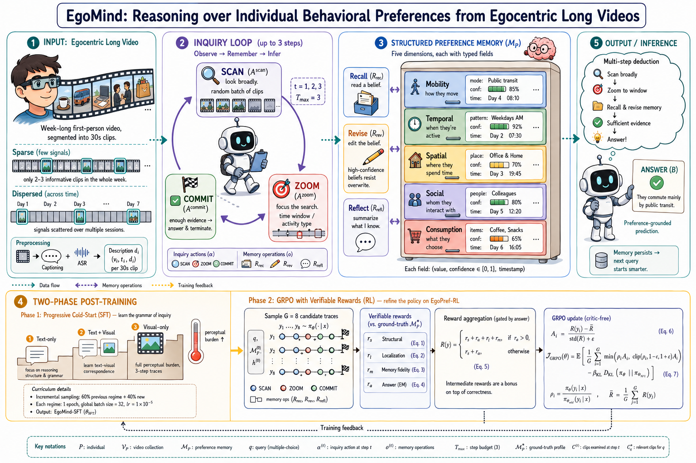

# EgoMind: Reasoning over Individual Behavioral Preferences from Egocentric Long Videos

  

Modeling individual behavioral preferences from egocentric long videos is a foundational capability for personalized AI assistants. Existing solutions are limited in two ways: frozen multimodal large language models (MLLMs) reason via ungrounded textual chains without accumulating user-specific knowledge across sessions, while retrieval-augmented approaches perform single-pass evidence lookup without iterative refinement — brittle precisely when preferences are sparse, dispersed, or implicit. We argue that preference modeling should be reframed as a post-training problem: the MLLM itself should learn to ground its reasoning in spatiotemporal evidence and to operate on a persistent preference memory as an explicit part of its reasoning trace. We present EgoMind, a framework that teaches an MLLM to observe, remember, and infer — identifying behavior-relevant evidence, reading from and writing to a structured per-individual preference memory, and producing preference-grounded predictions through multi-step deduction. We construct a large-scale dataset of preference-annotated reasoning traces spanning mobility, temporal, spatial, social, and consumption dimensions, and design a two-phase curriculum: progressive supervised fine-tuning followed by reinforcement learning with verifiable rewards that jointly optimizes evidence grounding, memory operations, and prediction accuracy. Experiments show EgoMind substantially outperforms both retrieval-augmented and post-trained MLLM baselines, with the largest gains on long-range, cross-session preference reasoning.
